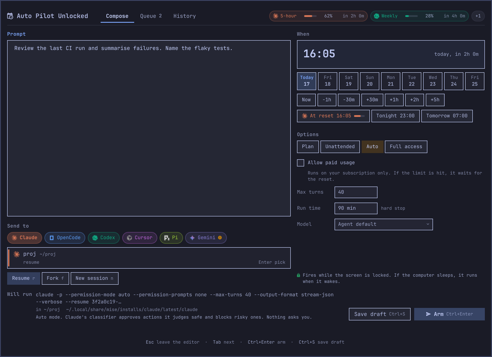
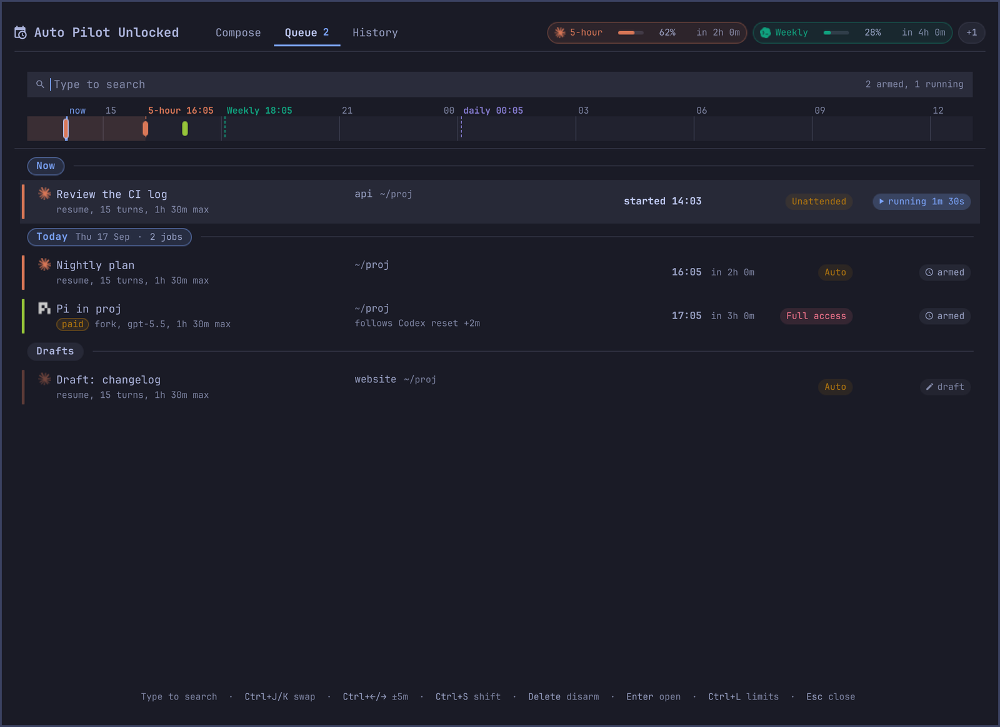
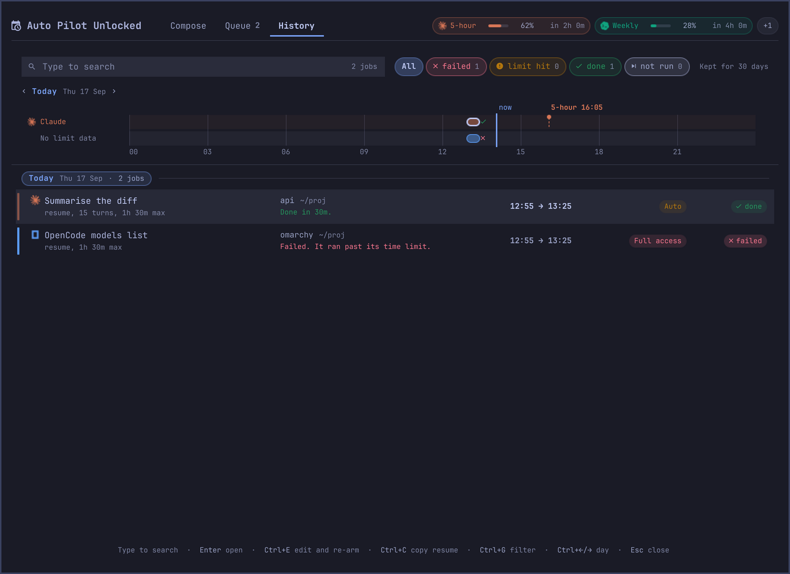
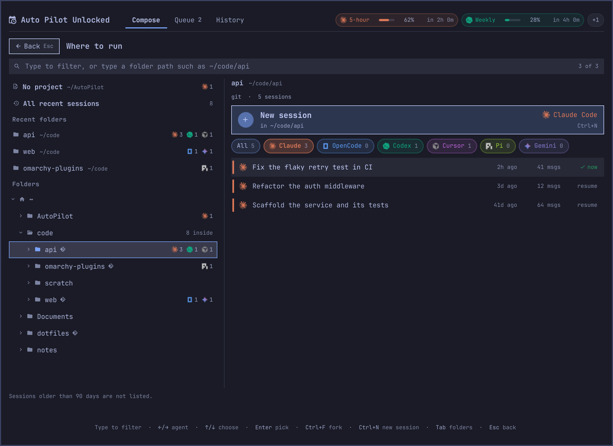

# Auto Pilot 4 Agents Unlocked

Unlocked edition, with Auto and Full access levels. Write a prompt now and send it later to a Claude Code, OpenCode, Codex, Gemini CLI, Cursor Agent or Pi session: in a few minutes, at a clock time, or right after a usage limit resets.

> **This is not the marketplace edition.** It adds two levels that pass each agent's own automatic-approval or permission-bypass flags. **Auto** lets the agent's automatic review approve actions. **Full access** turns permission checks off, so a job can edit files, run any command and reach the network with nobody watching. Arm them only for folders and sessions you would hand to that agent unattended. The marketplace edition, with Plan and Unattended only, is [Auto Pilot 4 Agents](https://github.com/oliwier-xiao/omarchy-auto-pilot4agents).

Each job runs headless in a transient systemd user timer, so it fires while the screen is locked and while the panel is closed. Auto Pilot shows the exact command before it arms anything, and afterwards it tells you what happened. Cursor Agent runs in Plan or Full access, and Pi in Plan, Auto or Full access (see [Cursor Agent and Pi](#cursor-agent-and-pi)).

**Install**

```
omarchy plugin add https://github.com/oliwier-xiao/omarchy-auto-pilot4agents-unlocked.git --enable
```

**Update**

```
omarchy plugin update oliwier.auto-pilot4agents-unlocked
```

**Remove**

Cancel its jobs first, see [Removal](#removal).

```
omarchy plugin remove oliwier.auto-pilot4agents-unlocked
```


## What it does

- **Compose.** Write a prompt, pick where it runs and how (an agent, a folder from the tree of your home folder, one of its sessions to resume or fork, a new session, or No project), a model, the permission level and the moment, and arm it. The moment can be now, in a few minutes or hours, a clock time up to 8 days ahead, or the next limit reset. **Allow paid usage** stays off unless you tick it.
- **Limits.** The panel header shows how much of each usage limit is used and when it resets, read from the usage records already on your computer.
- **Queue.** Armed jobs, grouped by day on a timeline with the limit resets marked. Move, swap, shift or disarm them.
- **History.** How each run ended (done, failed, limit hit, skipped, missed), with the last lines of output and a ready-to-paste resume command. A day timeline shows that day's runs, resets and armed jobs.
- **Bar and notifications.** The bar icon says what needs you: a problem, a running job, the countdown to the next job, or what finished. A notification tells you when a job finishes, fails or has to wait.









## Install

Auto Pilot Unlocked runs as an Omarchy Quattro shell plugin with a background service and a bar widget. No sudo or pkexec is required. It installs beside the marketplace edition: it has its own plugin id, timers, state folder and bar widget. It is not listed on plugins.omarchy.org.

```
omarchy plugin add https://github.com/oliwier-xiao/omarchy-auto-pilot4agents-unlocked.git --enable
```

If the bar does not pick it up:

```
omarchy restart shell
```

The widget is listed as **Auto Pilot Unlocked** in the bar's widget settings.

Update with `omarchy plugin update oliwier.auto-pilot4agents-unlocked`. Removal takes three steps, jobs
first: see [Removal](#removal).

## Dependencies

- Omarchy with the Quattro shell (`omarchy-shell`).
- `python3`. The helper uses the standard library only.
- A running systemd user manager. Every Omarchy login session has one.
- For the reset triggers and the limits header, the usage records kept in `~/.local/state/omarchy/agents/usage/` by Omarchy's agent usage service or by other tools you run. Auto Pilot only reads them (see [Limits](#limits)).
- At least one agent CLI, set up and signed in the way it documents.

Auto Pilot looks for each agent only in these places, in this order, and never searches `PATH`:

```
Claude Code   ~/.local/share/mise/installs/claude/latest/claude
              ~/.local/bin/claude
              /usr/bin/claude

OpenCode      /usr/bin/opencode
              ~/.opencode/bin/opencode
              ~/.local/bin/opencode

Codex         ~/.local/share/mise/installs/codex/latest/bin/codex
              ~/.local/bin/codex
              /usr/bin/codex

Gemini CLI    /usr/lib/node_modules/@google/gemini-cli/bundle/gemini.js

Cursor Agent  /usr/bin/cursor-agent
              ~/.local/bin/agent

Pi            ~/.local/share/mise/installs/pi/latest/pi/pi
```

Codex must be signed in with `codex login`, Cursor Agent with `cursor-agent login`, and Pi needs at least one signed-in provider (`pi` then `/login`). Gemini CLI is the package bundle, run by `/usr/bin/node`.

## Quick start

1. Click the Auto Pilot icon in the bar. A right click opens the panel straight on Compose.
2. Write the prompt.
3. Press `Tab` to reach **Send to**, then `Enter` to open **Where to run**. Pick a session, press `Tab` and pick a folder from the tree, or pick **No project** for work that needs no repository. A new draft has no agent and no session yet: picking a session or a folder chooses both, and arming before that says what is missing.
4. Press `Tab` to reach **When** and pick the moment: `k` for 5 minutes later, `r` for the next reset, or type `1405` and press `Enter` for 14:05.
5. Read the **Will run** line, then press `Ctrl+Enter` to arm.

The job waits in the Queue (`Ctrl+2`), the bar counts down to it, and a notification tells you how it ended.

## Where to run

**Where to run** opens from **Send to**. It has two panes.

- **Places and folders**, on the left:
  - **No project** is `~/AutoPilot`, for a report, a summary or research that needs no repository. The agent starts there, and at a level that may edit files it keeps them there; at Plan it writes nothing and its answer is in History. The folder is made, private to you, when you first pick it for a new session, and its earlier sessions can be resumed like any other. Cursor Agent and Gemini CLI have to trust it once, as any folder, and Codex asks you to allow it because it is not a git repository.
  - **All recent sessions** is every agent's newest sessions, across folders.
  - **Recent folders** are the folders with the newest sessions.
  - The folder tree starts at your home folder and never goes above it. A git checkout carries a git mark, and a folder with sessions carries each agent's mark and how many sessions it has there.
- **Sessions**, on the right: what the chosen place holds, newest first, under a large **New session** button that starts a new session there. The button names the folder and the agent it starts: the agent filter you chose, else the draft's agent, else the agent of the newest session in that folder, else the default agent in the settings. `Left/Right` changes it. `Enter` resumes the highlighted session and `Ctrl+F` forks it. The session the draft already uses is marked.

The right pane follows the folder the keyboard moves to, or the one you click. A chosen folder's own list is read for every agent, so it also shows sessions older than the newest 50 of All recent sessions. Typing words searches as well as filters: `projects` or `last man` lists the folders with those names from anywhere in your home folder, best first, above the sessions the words match. No path and no `~` is needed; case, accents and a letter or two off do not matter. `Enter` on a folder opens it, with **New session** there under the cursor, so a second `Enter` starts it. Typing a folder path such as `~/code/api` still opens the tree down to it.

New session is offered only for a folder that is there and that a job may run in. The helper checks the folder as soon as the cursor rests on it, and the button says why when it cannot be used: the folder does not exist, it is a file, others can write to it, or agent settings in it can be changed by others. If the check cannot answer in time, the job's own check still refuses such a folder when the job is created, armed and fired. A typed path that is not there lists the folders it most likely means instead of sessions: the same name in another case, a name a letter or two off, or `~/Projects` for `/Projects`. `Enter` opens one.

Your home folder itself is never a working folder. It can be browsed, and the sheet says so instead of offering a session there: pick a folder inside it, or No project. Hidden folders are not even read by name until `Ctrl+H`, and the search never looks at them.

## Triggers

| Trigger | Fires | Agents |
|---|---|---|
| Now | as soon as you press `Ctrl+Enter` a second time | all |
| In | a number of minutes or hours after arming. `+30m` to `+5h` add to the time shown, `−30m` and `−1h` take it back, down to Now | all |
| At | a clock time on any day up to 8 days ahead: pick the day in the day strip under the clock, or type the date | all |
| At the Claude reset | when the current Claude 5-hour window ends, plus a buffer | Claude Code |
| At the Codex reset | when the Codex usage window ends, plus a buffer | Codex, and Pi signed in with ChatGPT (`openai-codex`) |
| At the Gemini reset | at the next daily quota reset (midnight in Los Angeles), plus a buffer | Gemini CLI |
| At the Zen free reset | at the next 00:00 UTC, when the daily limit of the free OpenCode Zen models starts over, plus a buffer | OpenCode with a free Zen model |
| At the Go reset | when the OpenCode Go usage window ends, plus a buffer | OpenCode with an `opencode-go` model |

Cursor Agent has no reset trigger, because its included usage renews once a month. Its limits can still be read in the Limits sheet, which offers **Run at reset** when the reset is at most 8 days away.

OpenCode jobs no longer follow the Claude reset, because OpenCode never draws on the Claude plan. A job stored with it still fires at its stored time, but it cannot be armed on that trigger again.

The reset buffer defaults to 2 minutes and can be 1 to 9 minutes. A longer wait would shift where the next 5-hour window starts.

### When a job cannot run right away

The Claude reset time comes from Omarchy's usage record. Its freshness comes from the time Omarchy last fetched the limits (`~/.cache/omarchy/agent-usage/claude-limits.json`), and a record older than 30 minutes is marked stale. Auto Pilot never fetches usage itself. It reads the records again just before firing.

| Situation | What happens | At most |
|---|---|---|
| The window ends later than expected, or the new window is already used up | moves to the next reset | 4 times, never past 8 days |
| The run hits a limit anyway | re-armed for the next reset | 3 times |
| Paid usage is off and the limit or included usage is already used up | waits for the reset, or is skipped when that is more than 8 days away | 4 times |
| A monthly limit, or no quota or balance left | stops, without a retry | |
| A temporary error | retried after 2, 4 and 8 minutes | 3 times |
| The session is in use by another agent process | waits 10 minutes, then asks you to fork | 3 times |
| An error Auto Pilot cannot classify | retried after 30 minutes | once |

When the weekly limit is used up, the job waits for the weekly reset (the default) or is skipped, as you chose.

## Paid usage

Every job has an **Allow paid usage** checkbox in Compose, and it is off unless you tick it. **Paid usage for new jobs** in the settings changes that default. The checkbox is part of what you confirm when you arm, so changing it later means confirming the job again.

With paid usage off, a job runs only on a subscription or a free allowance. Anything that could bill dollars (an API key, usage credits, extra usage or a paid balance) is refused before arming, checked again just before firing, and stopped if a run starts to use it anyway. With paid usage on, the Will run line says the job may spend usage credits or API dollars.

| Agent | Paid usage off | Paid usage on |
|---|---|---|
| Claude Code | Runs on your Claude plan. A run whose API key source is not your sign-in is stopped and marked failed. A run that would use usage credits is stopped and waits for the reset. No budget flag is passed. | API keys and usage credits are allowed. `--max-budget-usd` caps the run. |
| Codex | Runs only when `codex login status` reports a ChatGPT sign-in. A Codex signed in with an API key is refused. | Any sign-in. |
| Gemini CLI | Refused when Gemini is set to an API key or Vertex AI in `~/.gemini/settings.json`. A Google sign-in runs. | Any sign-in. |
| OpenCode | Free OpenCode Zen models run. Free use has a daily limit that resets at 00:00 UTC, and free models may use prompts to improve the model. Paid Zen models are refused: they bill your OpenCode Zen balance. Claude models (`anthropic/...`) are refused: Claude models in OpenCode bill API or extra usage, not your Claude plan. OpenCode Go models run on the Go plan, and if Use balance is on in the OpenCode console, Go can also spend your Zen balance. Other providers bill through the provider in your OpenCode config, and a note says so. | Every model. |
| Cursor Agent | Runs on your included usage. When a fresh Cursor usage record shows the included usage, or the pool for the chosen model, used up, the job waits for the reset. Cursor may bill on-demand usage if it is turned on in your Cursor dashboard, and no command-line switch can turn that off. | Allowed, with the same on-demand note. |
| Pi | A ChatGPT sign-in (`openai-codex`) runs. GitHub Copilot, xAI and Kimi sign-ins run with a note that extra usage may bill if that account allows it. Claude through Pi is refused, because Pi bills Claude through extra usage. API keys, OpenRouter and Radius are refused. | Every provider. |

In both states a Cursor run that starts with an API key instead of your sign-in is stopped, and a Pi run that reports extra usage ran out, or would be drawn, is marked failed and never retried.

Auto Pilot tells a free OpenCode Zen model from a paid one by OpenCode's own model list and model catalogue. When that cannot be told, the job gets the provider note instead.

## Limits

The panel header shows one chip per usage source: how much of the limit is used and when it resets. The chips turn amber from 80 % and red from 95 %, `100 %+` means the limit is over, and a chip whose record is old says how old it is. Click a chip or the `+N` chip for the Limits sheet, which lists every source, including sources that report no limits and records that could not be read.

- **Where the numbers come from.** Auto Pilot reads the usage records in `~/.local/state/omarchy/agents/usage/` that Omarchy's agent usage service and other tools on your computer already keep. It reads at most 32 records of at most 64 KiB each, keeps only the limit windows, the plan name and the update time, and never reads token counts. It never collects usage itself, never starts a collector and never contacts a provider.
- **Computed resets.** Two resets need no record: the Gemini CLI daily quota (midnight in Los Angeles) and the OpenCode Zen free limit (00:00 UTC).
- **Which chips.** In **Limits in the header** in the settings, Auto shows the sources of the agents you have or have jobs for, and Custom shows the sources you tick, in your order.
- **Resets over time.** Resets seen in the records or reported by a run are kept for 14 days in `limits-history.json`, so the History day timeline can show where each window ended.

## Models

The model row in Compose opens the model picker. It lists the models each agent reports:

- OpenCode from `opencode models`, with a `free`, `Zen` or `Go` badge
- Codex from `codex debug models`
- Cursor Agent from `cursor-agent models`
- Pi from `pi --list-models`
- Claude Code: `fable`, `opus`, `sonnet` and `haiku`, each with the newest version it names, then pinned versions such as Claude Opus 5, named from the models.dev copy that OpenCode keeps. Without OpenCode, only the four names are listed. The model in your Claude settings is marked default.
- Gemini CLI from its installed package

The list is kept for 6 hours and `Ctrl+R` reads it again. **Agent default** leaves the choice to the agent. Pi has no Agent default, because Pi's own fallback would try Claude first.

## Permission levels

There are exactly four levels. The helper refuses any other value, whether it comes from the panel, the job store or IPC. Plan stays the default. In the panel, Unattended and Auto are amber and Full access is red.

**Plan and Unattended**

| Agent | Plan (default) | Unattended |
|---|---|---|
| Claude Code | Plan mode. Claude reads and proposes a plan. It does not edit files or run commands. | Only what your Claude permission rules already allow. Anything that would ask is denied. |
| OpenCode | Built-in plan agent without plugins. Edits, shell, web and subagents are denied. | Edits, shell, web and subagents are off, since nobody is there to approve them. Reads still work. |
| Codex | Read-only sandbox. Codex can read files but cannot write or reach the network. | Workspace-write sandbox. Codex can edit inside the working folder. Network stays off. |
| Gemini CLI | Plan mode. Gemini reads and plans. It does not edit files or run commands. | Only Gemini's own read, search and look-up tools run. Edits, shell and anything a settings file adds are denied. |
| Cursor Agent | Ask mode. Cursor reads and answers, and anything that would need your approval is denied, so no file is edited. | Not offered. Cursor applies file edits headless only with `--force`. Pick Full access for that. |
| Pi | Pi runs read-only here: read, grep, find and ls. It cannot edit files or run commands. | Not offered. Pi has no approval prompts. Auto lets it edit files, and Full access adds bash. |

**Auto and Full access**

| Agent | Auto | Full access |
|---|---|---|
| Claude Code | Auto mode. Claude's classifier approves actions it judges safe and blocks risky ones. Nothing asks you. | Bypass permissions. Claude edits files and runs any command without asking. |
| OpenCode | Edits, shell, web and subagents run, confined to the working folder by the OS sandbox. Reaching another folder would ask, so it is rejected. | Every permission is allowed, shell, web and folders outside the working folder included. |
| Codex | Automatic review in the workspace-write sandbox. A reviewer approves or denies what would ask. | No approvals and no sandbox. Codex runs any command with your user's access. |
| Gemini CLI | Auto edit. File edits, web fetch and shell commands run, confined to the working folder by the OS sandbox. Edits to Gemini's own settings or a .env file are denied. | YOLO mode. Every tool call is approved, shell commands included. |
| Cursor Agent | Not offered. Cursor has no automatic review of its own. | Force mode, workspace trusted, sandbox off. Cursor applies edits and runs commands without asking. |
| Pi | Pi reads, edits files and runs commands, confined to the working folder by the OS sandbox: read, bash, edit, write, grep, find and ls. | Every built-in tool: read, bash, edit, write, grep, find and ls. It is not sandboxed. |

Plan and Unattended never widen what an agent may do: a job only does what the agent's own configuration already allows without asking. Auto hands each decision to the agent's own automatic review, which can be wrong. Full access has no checks at all, and the job runs with your user's access to your files, your shell and the network. The systemd limits under [The timer](#the-timer) still apply, and the prompt still travels only on standard input.

Gemini CLI, run without a person, lets the model leave Plan mode on its own (`exit_plan_mode`), straight into approving every tool, and lets a Default or Auto edit run get into Plan mode first to do the same (`enter_plan_mode`). So a Gemini job at Plan, Unattended or Auto is started with `--admin-policy` and the plugin's own `bin/autopilot/gemini-policy.toml`, which denies both tools at the highest of Gemini's policy tiers. The same file holds each of those modes to a fixed list of tools: it denies every tool first, then lets through only `read_file`, `list_directory`, `glob`, `grep_search` and `update_topic` at Plan; those plus `google_web_search`, `get_internal_docs`, `complete_task` and Gemini's own read-only subagents at Unattended; and those plus `write_file`, `replace` and `web_fetch` at Auto, where the shell and any edit to Gemini's own settings or a `.env` file stay denied. So `tools.allowed`, a user policy or an MCP trust setting cannot add a tool to a level. A run whose output says the policy file could not be loaded ends as a boundary mismatch, not as done. Full access runs without it, since it already approves every tool. The helper checks that file against the text it ships with before every preview, arm and run of a Gemini job below Full access. Gemini CLI ignores `--admin-policy` when `/etc/gemini-cli/policies` holds a `.toml` file of its own, so on such a computer Gemini jobs below Full access are not armed or run, and the panel says why.

The exact flags for each level are listed under [Permission flags](#permission-flags). For Claude the runner also reads the permission mode Claude reports when it starts. If it is not the requested one, the run is stopped at once and marked failed.

## Cursor Agent and Pi

Cursor Agent runs in Plan or Full access. Pi runs in Plan, Auto or Full access.

### Cursor Agent

- **Why Plan or Full access.** Headless Cursor applies file edits only with `--force`, which approves every tool, so editing is Full access only. Plan uses Cursor's ask mode, where every tool that would ask for your approval is denied.
- **No sandbox flag.** Cursor's own sandbox needs privileges the job's systemd unit denies, so asking for it would only make the job fail. If your Cursor config turns it on, the job stops with that reason instead of retrying.
- **Checked once, then on.** A supervised Cursor run in a folder Cursor already trusts confirmed that the Plan command takes the prompt on stdin and applies no edits, so Cursor jobs arm like every other agent.
- **Before it arms and before it fires**, Auto Pilot refuses a Plan job when:
  - Cursor is set to Run Everything, which would approve every tool
  - Cursor's sandbox allows all network access
  - the folder or a parent up to its git root has its own `.cursor/cli.json`, or `.claude/settings.json` in the git root has allow rules, which Cursor would apply
  - Cursor does not trust the folder yet. Open `cursor-agent` in that folder once and choose Trust this workspace. A Plan job never marks a folder as trusted for you.
- **Full access skips those checks.** It already approves every tool and passes `--trust`, which trusts the job's folder without asking.
- **Sessions.** Only chats that Auto Pilot itself started can be resumed, and Cursor chats cannot be forked.

### Pi

- **Levels.** Pi has no approval prompts: a tool it may use runs without asking, so each level is a tool list. Plan gives it read, grep, find and ls. Auto adds edit and write. Full access adds bash. Every level runs without extensions, skills, prompt templates or themes, offline.
- **Provider and model.** Every Pi job needs both. Pick them in the model picker.
- **Sign-in check.** `pi auth check` confirms the sign-in for that provider before arming and again before firing.
- **Slash prompts.** A prompt that starts with `/` is refused, because Pi reads it as a command. Start it with a word.
- **Sessions.** Where to run lists the Pi sessions of the chosen folder. A job resumes or forks one by its full id, with the folder that holds its file in `PI_CODING_AGENT_SESSION_DIR`.

## Keyboard

The panel has three views, and every action has a key.

### Everywhere

| Key | Action |
|---|---|
| `Ctrl+1` `Ctrl+2` `Ctrl+3` | Compose, Queue, History |
| `Ctrl+PgUp/PgDn` | previous or next view |
| `Ctrl+,` | settings |
| `Ctrl+L` | limits |
| `Ctrl+N` | new prompt |
| `Ctrl+Z` | undo the last change |
| `Esc` | back one step, and close the panel last |

### Compose

| Key | Action |
|---|---|
| `Tab` / `Shift+Tab` | next or previous section |
| `Space` | tick or clear **Allow paid usage** when it has the cursor |
| `Enter` on the model row | open the model picker |
| `Ctrl+Enter` | arm; a Run now job needs a second press |
| `Ctrl+S` | save as draft |

### When

| Key | Action |
|---|---|
| `j/k` | 5 minutes earlier or later |
| `Shift+J/K` | an hour earlier or later |
| `Ctrl+J/K` | a day earlier or later |
| `0-9` | type a time: `1405` then `Enter` is 14:05 |
| `0-9` with `.` and a space | type a date, day first: `17.09 1830`, `17.09` (keeps the time shown) or `2026-09-17 18:30` |
| `j/k` on the day strip | a day earlier or later |
| `n` | now |
| `r` | the agent's next reset |
| `Left/Right`, `Enter` | move between the clock, the day strip and the chips, use one |

Digits always type a time or a date, so Now is on `n` rather than `0`. Clicking a day in the strip moves the job to that day and keeps its time.

### Queue

| Key | Action |
|---|---|
| type | search |
| `Up/Down`, `Enter` | move the cursor, open or close a job |
| `Ctrl+Left/Right` | move a job 5 minutes earlier or later |
| `Ctrl+Shift+Left/Right` | move a job an hour earlier or later |
| `Ctrl+Shift+J/K` | move a job a day earlier or later |
| `Ctrl+J/K` | swap times with the next or previous job |
| `Ctrl+Space`, `Ctrl+S` | mark jobs, then shift the marked jobs by the same amount |
| `Ctrl+E`, `Ctrl+D` | edit, duplicate |
| `Delete` twice | disarm, or delete a draft |
| `Ctrl+Enter` twice | run now |

With the mouse, drop a job on another job to swap their times, or on a day to move it there.

### History

| Key | Action |
|---|---|
| type | search |
| `Enter` | open or close a run |
| `Ctrl+Left/Right` | the day before or after on the day timeline |
| `Ctrl+Home` | today |
| `Ctrl+E` | edit and re-arm |
| `Ctrl+C` | copy the resume command |
| `Ctrl+G` | cycle the filter |
| `Ctrl+Enter` twice | run again |
| `Ctrl+R` | refresh |

### Where to run

| Key | Action |
|---|---|
| type | search folders by name and filter the sessions, or type a folder path |
| `Tab` | move between the sessions and the folders |
| `Up/Down` | choose |
| `Left/Right` | agent, in the sessions (also the agent New session starts); close or open a folder, in the folders |
| `Enter` | resume the session, start a new one on **New session**, or fill in a suggested folder; in the folders, go to its sessions |
| `Ctrl+F` | fork the highlighted session |
| `Ctrl+N` | new session in that folder |
| `Ctrl+H` | show or hide hidden folders |

### Model picker

| Key | Action |
|---|---|
| type | filter |
| `Up/Down` | choose |
| `Enter` | pick |
| `Ctrl+R` | read the model list again |
| `Esc` | back |

### Notices and settings

Every change shows a notice with an undo.

Settings hold the default agent and level, paid usage for new jobs, the limits in the header (`Space` ticks a source, `Alt+Up/Down` moves it), the reset buffer, the times for the Tonight and Tomorrow chips, notifications, reduced motion and **Cancel all jobs**. The bar label (next run, queued count, or nothing) is set in Omarchy's settings for this widget.

### Keybinding and IPC

The widget answers IPC, which is handy for a keybinding. No IPC method takes prompt text.

```
qs ipc -p /usr/share/omarchy/shell call oliwier.auto-pilot4agents-unlocked compose
```

The methods are `open`, `close`, `toggle`, `compose`, `queue` and `history`. `show` and `hide` are aliases for `open` and `close`.

## How it works

1. **Arm.** The helper checks the job and stores it in `~/.local/state/omarchy/auto-pilot4agents-unlocked/jobs.json`, with the prompt in `prompts/<job id>.txt`. Both files and the folder are private to you (0600 and 0700). A relative time such as "in 2 hours" becomes a fixed clock time at this moment, so suspending the computer does not stretch it.
2. **Timer.** It creates one transient systemd user timer for the job, named `ap4u-<job id>-g<generation>`, set to that exact second. The timer's own service is the runner. Nothing is written to your systemd configuration.
3. **Fire.** At that second the runner checks everything again:
   - the plugin is still installed and enabled
   - the kill switch is absent
   - the job still matches what you confirmed
   - for reset jobs, the new limit window has really opened
   - the agent binary is still trusted
   - the working folder is allowed, and it and its agent configuration are still writable by you alone
   - the paid usage rules, the sign-in (Codex, Pi) and Cursor's settings and folder trust
   - with paid usage off, the limit is not already used up
   - the session is not in use

   Then it starts the agent with the prompt on standard input and waits within the job's time limit. It reads how the run ended, writes a run record, deletes the prompt once the job is final and sends a notification.
4. **Reconcile.** When the shell starts, when you open the panel, every 5 minutes and after every run, a reconciler compares the jobs with the timers that exist. It re-creates a lost timer, marks a job that could not fire as missed, and removes stray units of this plugin.

## Security model

### Exact commands

Each agent is started from its absolute binary with one of these argument lists. `<level>` stands for the level's flags (see [Permission flags](#permission-flags)), square brackets mark optional parts, and the prompt is always `<stdin>`:

```
claude -p --output-format stream-json --verbose <level> --max-turns <n> [--max-budget-usd <usd>] [--model <model>]
       resume: --resume <session id>
       fork:   --resume <session id> --fork-session
       new:    --session-id <new uuid> --name autopilot-<job id prefix>
       <stdin>

opencode run --format json <level> [-m <model>]
       resume: -s <session id>
       fork:   -s <session id> --fork
       new:    --title autopilot-<job id prefix>
       <stdin>

codex exec --ignore-rules <level> --json --color never -o <runs folder>/<job id>-g<n>.last.txt [--skip-git-repo-check] [-m <model>]
       resume: resume <session id> -
       fork:   fork <session id> -
       new:    -
       <stdin>

/usr/bin/node /usr/lib/node_modules/@google/gemini-cli/bundle/gemini.js -p "" -o json <level> [--admin-policy <plugin folder>/bin/autopilot/gemini-policy.toml] [-m <model>]
       resume: --resume <session id>
       new:    --session-id <new uuid>
       <stdin>

cursor-agent -p --output-format stream-json <level> [--model <model>]
       resume: --resume <chat id>
       new:    nothing more
       <stdin>

pi --mode json <level> --provider <provider> --model <model>
       resume: --session <session id>
       fork:   --fork <session id>
       new:    --session-id <new uuid> --name autopilot-<job id prefix>
       <stdin>
```

Every agent starts in the job's working folder, and the folder is never one of its arguments. Pi is always told the folder for its session in its environment (`PI_CODING_AGENT_SESSION_DIR`) rather than on the command line: for a resume or fork it is the folder that holds the session file, and for a new session the folder Pi would file it in, so a project's own Pi settings cannot send the transcript elsewhere.

`--max-budget-usd` is passed only when **Allow paid usage** is on. `--skip-git-repo-check` is added only after you confirm a Codex job in a folder that is not a git repository. The turn and budget limits exist only for Claude. Every agent is also bound by the job's runtime limit. Cursor Agent and Pi get no prompt word at all: both read the prompt from standard input until it ends.

### Permission flags

The level becomes exactly these flags and variables:

```
Claude Code   plan         --permission-mode plan --permission-prompts none --tools Glob,Grep,Read
                           --setting-sources user --strict-mcp-config
              unattended   --permission-mode dontAsk --permission-prompts none
                           --tools Bash,Edit,Glob,Grep,NotebookEdit,Read,WebFetch,WebSearch,Write
                           --disallowedTools Write(~/.claude/**),Edit(~/.claude/**),Write(.claude/**),Edit(.claude/**)
                           --setting-sources user --strict-mcp-config
              auto         --permission-mode auto --permission-prompts none --setting-sources user --strict-mcp-config
              full         --permission-mode bypassPermissions --permission-prompts none --setting-sources user --strict-mcp-config
              every level  CLAUDE_CODE_DISABLE_AUTO_MEMORY=1 CLAUDE_CODE_DISABLE_CRON=1

OpenCode      plan         --pure --agent plan
                           OPENCODE_PERMISSION={"edit":"deny","bash":"deny","webfetch":"deny","websearch":"deny","task":"deny","external_directory":"deny","doom_loop":"deny"}
              unattended   OPENCODE_PERMISSION={"edit":"deny","bash":"deny","webfetch":"deny","websearch":"deny","task":"deny","external_directory":"deny","doom_loop":"deny"}
              auto         OPENCODE_PERMISSION={"edit":"allow","bash":"allow","webfetch":"allow","websearch":"allow","task":"allow","external_directory":"deny","doom_loop":"deny"}
              full         --auto
                           OPENCODE_PERMISSION={"edit":"allow","bash":"allow","webfetch":"allow","websearch":"allow","task":"allow","external_directory":"allow","doom_loop":"allow"}
              every level  OPENCODE_DISABLE_PROJECT_CONFIG=1

Codex         plan         -s read-only
              unattended   -s workspace-write
              auto         --approve-for-me
              full         --dangerously-bypass-approvals-and-sandbox
              every level  --ignore-rules

Gemini CLI    plan         --approval-mode plan
              unattended   --approval-mode default
              auto         --approval-mode auto_edit
              full         --approval-mode yolo
              plan, unattended and auto also --admin-policy <plugin folder>/bin/autopilot/gemini-policy.toml --extensions ap4a-none --allowed-mcp-server-names ap4a-none

Cursor Agent  plan         --mode ask
              unattended   not offered
              auto         not offered
              full         --force --trust --sandbox disabled

Pi            plan         --offline --no-extensions --no-skills --no-prompt-templates --no-themes --no-approve --tools read,grep,find,ls
                           PI_OFFLINE=1 PI_TELEMETRY=0 PI_SKIP_VERSION_CHECK=1
              unattended   not offered
              auto         the plan flags with --tools read,bash,edit,write,grep,find,ls
              full         the plan flags with --tools read,bash,edit,write,grep,find,ls

At auto, OpenCode, Gemini CLI and Pi also run under an OS sandbox (Linux Landlock plus a seccomp
filter): the agent may write only the working folder, a private tmp and its own data folder, may
read the system and its own config but not your secrets, and may open no Unix-domain socket, so the
shell cannot reach the session bus to escape. On a kernel without Landlock, auto is refused for
these three agents.
```

### The timer

Arming runs exactly this, with the calendar options left out for Run now:

```
/usr/bin/systemd-run --user --quiet --no-ask-password --collect --unit=ap4u-<job id>-g<n> --description="Auto Pilot Unlocked job"
    --on-calendar=@<epoch> --timer-property=AccuracySec=1s
    -p Type=exec -p RuntimeMaxSec=<runtime> -p TimeoutStopSec=30s -p KillMode=control-group -p SendSIGKILL=yes
    -p MemoryHigh=3G -p MemoryMax=4G -p TasksMax=512 -p CPUWeight=50 -p OOMPolicy=kill -p Nice=10
    -p IOSchedulingClass=best-effort -p IOSchedulingPriority=7 -p NoNewPrivileges=yes -p UMask=0077 -p LimitCORE=0
    -p StandardInput=null -p StandardOutput=null -p StandardError=journal -p SyslogIdentifier=ap4u
    -p LogRateLimitIntervalSec=30s -p LogRateLimitBurst=200 -E PATH=/usr/bin -E LANG=C.UTF-8
    -p "UnsetEnvironment=DISPLAY WAYLAND_DISPLAY HYPRLAND_INSTANCE_SIGNATURE OMARCHY_PATH"
    -- /usr/bin/python3 -I -S -B <plugin folder>/bin/ap4a run --job <job id> --gen <n>
```

Units are created only when you arm or run a job. No unit files are written, nothing starts when the plugin is enabled, lingering is never changed and the systemd configuration is never reloaded.

Disarming stops the timer and the service, checks that both are gone, and bumps the job's generation first. A timer that fires late then finds a stale generation and exits without running anything.

### Guarantees

- Plan and Unattended pass no automatic-approval or permission-bypass flag. Auto and Full access pass exactly the flags listed under [Permission flags](#permission-flags), and only for a job you armed at that level.
- The prompt travels only on standard input: from the panel to the helper, and from the stored file to the agent. It never appears in a command line, an environment variable, a unit property, the journal or a notification. Lines in which an agent echoes the prompt back are left out of the run log.
- A job you do not name is labelled from its agent and folder (for example "Claude Code in myproject"), never from the prompt.
- The prompt file is deleted when the job reaches a final state.
- Before arming, the panel shows the exact command, the working folder, the binary, what the level means and what paid usage allows.
- Arming is bound to a digest of the agent, the binary's path, the session, the level, the limits, the model, the Pi provider, the paid usage setting, the trigger kind and the prompt's hash. If any of them changes before the job fires, it does not run and asks you to check it.
- Agent binaries come only from the fixed locations listed under [Dependencies](#dependencies), and version-manager shims are refused. Each binary must be a regular file owned by you or root that nobody else can write, in folders nobody else can write, and it is checked again right before it runs.
- The agent gets a short list of environment variables. Claude Code, OpenCode, Codex and Gemini CLI get `HOME`, `USER`, `LOGNAME`, `LANG`, `XDG_RUNTIME_DIR`, `DBUS_SESSION_BUS_ADDRESS`, the `XDG_*_HOME` folders, `NO_COLOR=1`, `TERM=dumb`, `PATH=/usr/bin:/bin:$HOME/.local/bin`, `OPENCODE_PERMISSION` and `OPENCODE_DISABLE_PROJECT_CONFIG=1` for OpenCode, and `CLAUDE_CODE_DISABLE_AUTO_MEMORY=1` with `CLAUDE_CODE_DISABLE_CRON=1` for Claude Code. Cursor Agent gets `HOME`, `USER`, `LOGNAME`, `LANG`, `XDG_RUNTIME_DIR`, `XDG_CONFIG_HOME`, `XDG_DATA_HOME`, `TERM=dumb`, `NO_COLOR=1` and `PATH=/usr/bin:/bin`. Pi gets `HOME`, `LANG`, `TERM=dumb`, `PATH=/usr/bin:/bin`, the three `PI_*` variables above and `PI_CODING_AGENT_SESSION_DIR`, the folder for its session. At Auto, OpenCode, Gemini CLI and Pi also get a private `TMPDIR` and `npm_config_cache` inside the job's run folder, Gemini CLI gets `SANDBOX=sandbox-exec`, and OpenCode gets `CLAUDE_CONFIG_DIR` pointed at the run's private folder (oh-my-openagent keeps Claude Code transcripts there), so the sandboxed run's scratch, caches and state stay inside what it may write. API keys, tokens and display variables are never passed on.
- The working folder is the session's own recorded folder, or the one you pick for a new session. `/`, your home folder itself, `/tmp`, `/run`, the plugin folder and `~/.config/omarchy/plugins` are refused. No project is `~/AutoPilot`, which passes the same check.
- The working folder has to be yours and writable by you alone, and so does the agent configuration already in it: `.claude`, `.codex`, `.cursor`, `.gemini`, `.opencode`, `.pi`, `.mcp.json`, `opencode.json`, `opencode.jsonc`, `AGENTS.md`, `CLAUDE.md`, `GEMINI.md` and everything directly inside those folders must belong to you or root, with nobody else able to write to them. Whoever could change them would choose the hooks, allow rules, MCP servers and instructions a run loads while nobody is watching. This is checked when you arm a job and again when it fires.
- A job does not start the agent if, when it fires, the kill switch exists, the plugin is not enabled in the bar, the plugin folder no longer matches its manifest, or its code (`bin/ap4a`, `bin/autopilot`, its bytecode cache and every folder above them) could be changed by anyone but you or root. It is paused and you are told why; arming checks the same code first.
- Every account on the computer can read a process's command line. The command lines Auto Pilot starts carry only job ids, generations, digests, times, limits, the agent, model, provider and session id, and for Gemini CLI the path of the plugin's own policy file. Never a folder (the working folder, one the folder picker walks or one it lists sessions for), a session file's path, a job's label, a notification's text, a prompt, a key or a token: the agent starts in its working folder instead of being told it, the panel sends every folder and every search to the helper on standard input, and a notification goes to the session bus over the bus's own socket rather than through a program.
- The system tools it calls (`systemd-run`, `systemctl`, `qs`, `timedatectl`) must be owned by root and writable by nobody else, in folders nobody else can write. Otherwise the call is refused.
- Gemini CLI below Full access loads no extension or MCP server from a working folder (`--extensions ap4a-none --allowed-mcp-server-names ap4a-none`): a folder's own extension or server would otherwise run its code when Gemini starts, outside the approval policy. The admin policy still covers the tools. At every level, a folder whose own `.gemini/settings.json` names hooks, tool discovery or call commands, a sandbox, MCP servers, telemetry, agents or extra folders is refused, because Gemini runs or applies these when it starts, before any policy; so is a folder where the first `.env` Gemini would load, from the folder up to your home folder, sets a `GEMINI_*`, `GOOGLE_*`, `CODE_ASSIST_*`, `OTEL_*`, `SANDBOX*`, `NODE_*` (but `NODE_ENV`) or `*_PROXY` variable, which could move its endpoint, sign-in or settings.
- Auto Pilot never writes agent configuration, hooks, skills, MCP settings or instruction files, and makes no network requests of its own. Besides its own state and runtime folders, the only folder it makes is `~/AutoPilot`, mode 0700, when you pick No project for a new session and nothing is there yet. Whatever is already at that path is used only when it is a folder of yours, not a link, that nobody else can write; anything else is left as it is and refused. The only level that trusts a folder is Full access for Cursor Agent, through Cursor's own `--trust`.
- A run is pinned to your own settings, not a folder's. A working folder cloned from elsewhere is yours too, so its own agent configuration could otherwise run code, take the sign-in or widen the run while nobody is watching. Claude Code reads only your user settings and no folder MCP (`--setting-sources user --strict-mcp-config`) and does not write its durable memory or scheduled tasks; Plan offers Claude only Glob, Grep and Read, and Unattended only the tools your own allow rules can open, never a write to Claude's own settings or memory (`--tools`, `--disallowedTools`), so neither reaches a tool that needs no permission (subagents, worktrees, remote triggers) or, in Plan, the auto-mode classifier that could approve a command; a run whose start reports any other tool, or an MCP server, is stopped; OpenCode never loads a folder's `opencode.json` or `.opencode` (`OPENCODE_DISABLE_PROJECT_CONFIG=1`), and a folder with OpenCode plugin code in it or in any folder above it (a `.opencode/plugin` folder, or a plugin listed under `plugin` in an `opencode.json`) is refused, because OpenCode runs that code at startup whatever the level, and that flag does not stop it (keep your own plugins in `~/.config/opencode`, where they still load); Codex drops the execpolicy allow rules that would leave its sandbox (`--ignore-rules`), and a folder with its own `.codex/config.toml`, in it or in any folder above it, is refused, because Codex loads that file once it trusts the folder and it can start programs outside the sandbox; and a Cursor folder with its own CLI rules, hooks, MCP servers or imported Claude allow rules is refused, as before.
- At Auto, where the shell is on, OpenCode, Gemini CLI and Pi run under an OS sandbox (Linux Landlock and a seccomp filter, applied as the agent starts, needing no privilege). The process may write only the working folder, a private tmp inside the job's run folder, and its own data folder; it reads the system and its own config, not the rest of your home folder, so `~/.ssh`, `~/.gnupg` and another tool's tokens are unreadable; its own config stays read-only, so it cannot plant something a later run would load. For OpenCode that includes the plugins' own code under `~/.cache/opencode` and oh-my-openagent's settings in `~/.omo`; it writes only its lock files under `~/.local/state/opencode/locks`, and nothing under `~/.claude` is opened, the Claude sign-in included. Your OpenCode plugins load and run inside the sandbox; a tool of theirs that needs a Unix-domain socket (oh-my-openagent's tmux shell) fails there. It may open no Unix-domain socket, so it cannot reach the session bus or `systemd --user` to start a process outside the sandbox. Ordinary network (`AF_INET`) stays open, so `npm`/`pip` installs and documentation fetches still work. On a kernel without Landlock the sandbox cannot be built, so Auto is refused for these three agents (`sandbox_unavailable`); Codex keeps its own sandbox and Claude Code its classifier, and Full access is unconfined by design. What this does not stop, with the network open: the agent's own model sign-in stays readable (it must, to run), so a run that is told to can still send it out, exactly as at Full access; and a shell can read other processes' environment through `/proc`. Arm Auto only for work you would hand that agent unattended.

### What it reads, and what it never opens

Every read is size-capped, does not follow links and keeps only the fields listed. Two places resolve a link: the folder tree, only to tell whether it leads to a folder inside your home folder, never opening one; and the working folder check, which judges a folder and the agent configuration in it by what a link leads to, the way the agent would load it.

- **Read:** the plugin's own `bin/autopilot/gemini-policy.toml`, and the names in `/etc/gemini-cli/policies` (only whether one ends in `.toml`), before a Gemini job below Full access; a Gemini job's own `.gemini/settings.json` (whether it names start-up commands or wider access) and the first `.env` Gemini would load, from that folder up to your home folder (only its variable names); the usage records in `~/.local/state/omarchy/agents/usage/` and `~/.cache/omarchy/agent-usage/claude-limits.json` (limits, plan name, update time); `~/.gemini/settings.json` (the selected sign-in type and default model); `~/.claude/settings.json` (the `model` setting and the `ANTHROPIC_DEFAULT_*_MODEL` pins); Cursor's `cli-config.json` in `$XDG_CONFIG_HOME/cursor` and `~/.cursor` (its approval and network settings); `.claude/settings.json` and `.claude/settings.local.json` in the git root of a Cursor job's folder (whether they have allow rules or hooks); `opencode.json` and `opencode.jsonc`, at the top and in `.opencode/`, in an OpenCode job's folder and every folder above it but your home folder (whether they list plugins); the global `opencode.json` or `opencode.jsonc` (the default model) and `~/.cache/opencode/models.json` (model names and prices); the session stores Where to run lists (the first records of Claude transcripts and Pi session files, and the OpenCode and Codex databases opened read-only); before a new session in a folder, that folder's owner and mode and those of the agent configuration entries in it (`.claude/`, `.codex/`, `CLAUDE.md`, `AGENTS.md` and the like) and of the entries directly inside those folders, at most 256 each, the same check a job gets when it is armed; `/proc/self/mountinfo`, to know where other file systems are mounted; for the folder tree, the names of the subfolders of one folder of your home folder at a time (hidden ones only after `Ctrl+H`), whether each has a `.git` entry (looked at with lstat, never opened), and who owns the folder a link leads to when that folder is inside your home folder; for a folder search, the names of the folders under your home folder, down to 8 levels, never inside a hidden folder, another file system or a link (a folder another file system is mounted on is not even opened), and never inside `node_modules`, `build`, `dist`, `target`, `venv` and the like (their names are matched, their insides are not read). Only the 40 best matches reach the panel, with whose folder each is and whether it has a `.git` entry. Nothing is written or kept between searches.
- **Looked at, never opened:** `.cursor/cli.json`, `.cursor/hooks.json` and `.cursor/mcp.json` in a Cursor job's folder and its parents; the file names in `.opencode/plugin` and `.opencode/plugins` in an OpenCode job's folder and every folder above it; `.codex/config.toml` in a Codex job's folder and every folder above it but your home folder; `~/.cursor/projects/<folder>/.workspace-trusted`; Cursor chat folders and their `store.db-wal` times; `opencode.json`, `opencode.jsonc` and `.opencode/` in an OpenCode job's folder.
- **Never opened:** `~/.claude/.credentials.json`, `~/.codex/auth.json`, `~/.pi/agent/auth.json`, `~/.pi/agent/models.json`, `~/.local/share/opencode/auth.json`, `~/.config/cursor/auth.json`, Cursor's `state.vscdb` and chat databases, and Gemini's sign-in files. No command that prints a key or a token is ever run.
- **Checks it runs without a prompt**, with the agent's own environment and a time and size limit: `codex login status`, `pi auth check --provider <provider> --json --no-refresh`, `cursor-agent status` (only whether it is signed in is kept), and the model listings under [Models](#models).

### Resource bounds

- The panel starts processes through one wrapper that clears the environment, uses absolute paths, caps output while it is produced, enforces a deadline, and kills the process on timeout or when the panel is destroyed. It never starts detached processes.
- The panel shows all text from outside as plain text.
- The helper's own tool calls end with it: TERM unwinds the helper, which kills each call's process group. Every call also asks the kernel to kill it if the helper dies first.
- Each helper request is one JSON line of at most 256 KiB with read timeouts. Every answer has a size cap and every command has a time limit.
- An agent run gets its own process group, keeps at most the last 256 KiB of its output in a private log, and is stopped at the job's runtime limit (TERM, then KILL after 10 seconds). The unit's memory, task and time limits are the outer bound.
- Run logs are kept for the last 20 runs of a job and 500 overall.
- State files are opened without following links, must be regular files owned by you with a single link, are size-capped before parsing, and are written through a private temporary file, `fsync` and rename.
- The job store holds at most 200 jobs in 1 MiB. A new job is refused once the store is three quarters full, and the oldest finished jobs make way before an armed job could fail to change state.
- Where to run lists at most 50 sessions per agent from the last 90 days, for all recent sessions and for one folder alike. It reads only the first 40 records (64 KiB) of a Claude transcript and the first 30 records of the newest 50 Pi session files, opens the OpenCode and Codex databases read-only with a size ceiling and a 3 second deadline, and caps every string.
- The folder search reads at most 5,000 entries of any one folder, 200,000 entries and 20,000 folders in all, 8 levels deep, within 1.5 seconds (the clock is read before every folder and every entry), answers at most 40 folders, and says when it stopped early. A word counts its first 32 letters and a name its first 256, so no one name takes long to match. It runs only after the typing rests, one search at a time.
- The folder tree reads one folder at a time, only inside your home folder, through a descriptor opened without following a link: at most 4000 entries within 2 seconds, and at most 400 subfolders answered, fewer when the answer would pass 256 KiB. A link is shown as a link, and opens at its target only when that is a folder inside your home folder. A folder another file system is mounted on is listed by name and not looked at until you open it, so a mount whose server has gone away cannot hold up the tree. Names that are not printable text are left out and counted.
- A folder's own session list gives every agent its own share of the time and bytes, reads only that folder's rows from the OpenCode and Codex databases, and reads only the Claude project folder named after it, never the transcripts of other projects.
- A model list holds at most 1000 entries. Each listing is read with a 20 second deadline and an output cap of 256 KiB to 1 MiB, and kept for 6 hours.

## Limitations

- **Sleep.** If the computer sleeps, the job runs when it wakes (within 15 minutes, or 3 hours for reset jobs). Auto Pilot does not keep the computer awake and does not wake it.
- **Logout.** Jobs run only while you are logged in. Missed jobs are offered when you log back in.
- **Missed jobs.** They stay in the Queue marked missed, with Run now, for 24 hours. After that their stored prompt is deleted and they move to History, where Edit and re-arm asks you to write the prompt again.
- **Codex.** It stays disabled in the panel until `codex login status` reports a signed-in account. Its chip carries a warning glyph; choosing it opens a sign-in popup with the exact command to run, `codex login`, and a **Check again** button. A Codex run that may write (`-s workspace-write`) has Codex mark a new folder trusted in `~/.codex/config.toml` by itself, as it does when you run it; Auto Pilot refuses any folder with its own `.codex/config.toml`, so that trust has nothing of the folder's to load.
- **Gemini CLI.** Its sign-in cannot be checked without a run, so its chip carries the same warning glyph until the first job ends, and its sign-in popup says to run `gemini` once and pick a sign-in there. Gemini refuses to work in a folder it does not trust yet, so trust the folder in Gemini first. Gemini sessions cannot be forked.
- **Cursor Agent.** Only Plan and Full access are offered, chats cannot be forked, and a monthly limit ends the job without a retry. Cursor has to trust the folder first. On-demand usage is a Cursor account setting that Auto Pilot cannot switch off.
- **Pi.** Unattended is not offered, every job needs a provider and a model, and Pi reports a finished run even when the provider failed, so Auto Pilot judges the run by Pi's last answer rather than its exit code.
- **The Auto sandbox needs a recent Linux.** The OS sandbox for OpenCode, Gemini CLI and Pi at Auto uses Landlock, in the kernel since 5.13 and on by default on Omarchy. Without it, Auto is refused for these agents (pick Plan, Unattended or, on your own responsibility, Full access). It confines the filesystem and blocks the socket escape; it is defence in depth around the agent's own confinement, not a full virtual machine, and it does not change the network, so an agent told to exfiltrate its own model sign-in still could. The per-agent writable sets were found against each real CLI; validate on your own machine before trusting a new agent version.
- **Editing files with Claude.** An Unattended Claude job edits files only where your own Claude permission rules already allow it. Claude's WebFetch also reads a fixed list of documentation sites (docs.python.org and the like) without a rule, and Unattended keeps that. Auto and Full access edit without asking.
- **Auto and Full access are unverified live.** Their flags come from each agent's own `--help`. The helper and panel tests cover the commands they build, but no scheduled run at these levels has been watched end to end yet.
- **Project settings.** Hooks and MCP servers configured in the working folder run as they would in a terminal. Pi reads the folder's context files, as it does in a terminal. Auto Pilot only makes sure nobody but you can change them; what they do is up to you.
- **Resuming.** A job that resumes a session adds its turns to that session. Fork the session if you want the original left untouched.
- **Budget.** `--max-budget-usd` is Claude's own estimate and is used only with paid usage on. The turn limit and the runtime limit are the hard caps.
- **Reset triggers and limits.** They need the usage records other tools keep, except the two computed resets. Without a record, pick a time instead.

## Removal

1. Cancel every job first. This disarms all jobs and stops every timer and running job this plugin created, including leftovers. **Cancel all jobs** in the panel's settings does the same.

   ```
   /usr/bin/python3 -I -S -B ~/.config/omarchy/plugins/oliwier.auto-pilot4agents-unlocked/bin/ap4a cancel-all
   ```

   If its answer says the stop could not be confirmed, run it again.

2. Remove the plugin:

   ```
   omarchy plugin remove oliwier.auto-pilot4agents-unlocked
   ```

3. Optionally delete its data (`~/AutoPilot` is yours and stays, with whatever No project sessions wrote there): `~/.local/state/omarchy/auto-pilot4agents-unlocked` (jobs, stored prompts, run logs, model lists and the limits history) and `~/.config/omarchy/auto-pilot4agents-unlocked`.

A job can never fire into a removed or disabled plugin. If step 1 is skipped, a timer that fires afterwards finds the plugin gone or disabled, does not start the agent, and marks the job paused.

### Pause without removing

Create the kill switch file `~/.config/omarchy/auto-pilot4agents-unlocked/DISABLED`. While it exists no job fires and nothing can be armed, and `cancel-all` still works. Delete the file to switch Auto Pilot Unlocked back on.

## Development

`tests/run.sh` runs every suite: the helper's unit tests, the prompt canary, the QML engine cases and `qmllint`, the repository policy checks and the marketplace preflight. The prompt canary scans every process's command line and environment during whole Claude Code and Pi runs, a Cursor Agent preview and the models, usage and timeline answers, for a random canary prompt.

The tests use stub tools, stub agents and a temporary home folder, and they never touch your real jobs or your user manager. `AP4A_REAL_CLI=1 tests/run.sh` also runs the one case that starts the installed OpenCode against a local stand-in server, without a model. `dev-sync.sh` copies the working tree into `~/.config/omarchy/plugins` for a live try.

## License

MIT. See [LICENSE](LICENSE).
